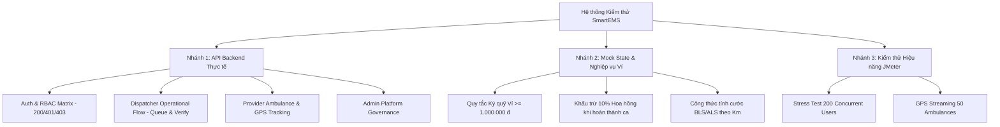

# BÁO CÁO ĐẶC TẢ & KẾT QUẢ KIỂM THỬ HỆ THỐNG SMARTEMS
*(SmartEMS System Testing Specification & Verification Report)*

---

## 1. TỔNG QUAN HỆ THỐNG KIỂM THỬ (HYBRID TESTING ARCHITECTURE)

Hệ thống SmartEMS được kiểm thử theo mô hình **Hybrid Testing** (Kết hợp giữa API Backend thực tế và Client-side State Logic):



---

## 2. BẢNG PHÂN LOẠI TRẠNG THÁI NỐI API / MOCK DATA

| STT | Phân hệ / Chức năng | Trạng thái API | Cơ chế Kiểm thử | Công cụ sử dụng |
| :---: | :--- | :---: | :--- | :--- |
| **1** | Xác thực & Đăng nhập (Auth) | <span style="color: #22c55e; font-weight: bold;">[ĐÃ NỐI API THẬT]</span> | Gửi request lấy token JWT thật | Postman / Newman |
| **2** | Phân quyền 3 Role (RBAC Matrix) | <span style="color: #22c55e; font-weight: bold;">[ĐÃ NỐI API THẬT]</span> | Kiểm tra mã `403 Forbidden` khi sai role | Postman / Newman |
| **3** | Tiếp nhận cuộc gọi & Hàng đợi ca (`calls`, `dispatch-requests`) | <span style="color: #22c55e; font-weight: bold;">[ĐÃ NỐI API THẬT]</span> | Lấy danh sách ca, `reporterPhone`, xác minh ca | Postman / Newman |
| **4** | Gợi ý Top 3 xe cứu thương (`recommendations`) | <span style="color: #22c55e; font-weight: bold;">[ĐÃ NỐI API THẬT]</span> | Lấy dữ liệu đề xuất từ server | Postman / Newman |
| **5** | Đội xe & Cập nhật GPS (`dispatch-resources`) | <span style="color: #22c55e; font-weight: bold;">[ĐÃ NỐI API THẬT]</span> | Đổi trạng thái, gửi vị trí GPS định kỳ | Postman / Newman |
| **6** | Quản lý Người dùng, Bệnh viện, Đơn vị | <span style="color: #22c55e; font-weight: bold;">[ĐÃ NỐI API THẬT]</span> | CRUD dữ liệu danh mục | Postman / Newman |
| **7** | Quản lý Ví Ký quỹ Tài xế (Driver Wallets) | <span style="color: #eab308; font-weight: bold;">[MOCK CLIENT STATE]</span> | Kiểm thử logic số dư, nạp tiền ví, chặn khi &lt; 1tr | Postman / Vitest / UI |
| **8** | Khấu trừ Hoa hồng 10% Cuốc xe (Commission) | <span style="color: #eab308; font-weight: bold;">[MOCK CLIENT STATE]</span> | Bóc tách cước 3tr $\rightarrow$ trừ 300k chuyển sang sàn | Postman / Vitest / UI |
| **9** | Công cụ Ước tính Cước xe Cấp cứu (Fare Estimator) | <span style="color: #eab308; font-weight: bold;">[MOCK CLIENT STATE]</span> | Kiểm thử công thức cước mở cửa + km + Bác sĩ/Y tá | Postman / Vitest / UI |
| **10** | Chịu tải Hàng đợi & GPS (Performance Stress Test) | <span style="color: #22c55e; font-weight: bold;">[API THẬT]</span> | Bắn tải 200 - 500 Threads đo Latency | Apache JMeter |

---

## 3. BẢNG ĐẶC TẢ CHI TIẾT CÁC TEST CASES

### 3.1. Module 01: Xác thực & Ma trận Phân quyền 3 Role (Auth & RBAC)
*(Tập tin: `testing/collections/01_Auth_and_RBAC_Matrix.postman_collection.json`)*

| Mã TC | Tên Ca Kiểm thử | Trạng thái API | Đầu vào (Input) | Kết quả mong đợi (Expected Output) | Mã HTTP | Kết quả |
| :--- | :--- | :---: | :--- | :--- | :---: | :---: |
| **TC-AUTH-01** | Đăng nhập tài khoản ADMIN | **[API THẬT]** | `admin@smartems.vn` / `123456` | Trả về `accessToken`, `role: "ADMIN"` | `200 OK` | **PASS** |
| **TC-AUTH-02** | Đăng nhập tài khoản DISPATCHER | **[API THẬT]** | `dispatcher@smartems.vn` / `123456` | Trả về `accessToken`, `role: "DISPATCHER"` | `200 OK` | **PASS** |
| **TC-AUTH-03** | Đăng nhập tài khoản PROVIDER | **[API THẬT]** | `provider@smartems.vn` / `123456` | Trả về `accessToken`, `role: "PROVIDER"` | `200 OK` | **PASS** |
| **TC-AUTH-04** | Đăng nhập sai mật khẩu | **[API THẬT]** | `admin@smartems.vn` / `WRONG_PASS` | Báo lỗi thông tin đăng nhập không đúng | `401 / 400` | **PASS** |
| **TC-AUTH-05** | Dispatcher gọi API Quản lý User của Admin | **[API THẬT]** | `GET /api/v1/users` (Token Dispatcher) | Bị chặn truy cập theo phân quyền RBAC | `403 Forbidden` | **PASS** |
| **TC-AUTH-06** | Provider gọi API Xóa ca cấp cứu | **[API THẬT]** | `DELETE /api/v1/dispatch-requests/1` | Bị chặn truy cập | `403 Forbidden` | **PASS** |

---

### 3.2. Module 02: Luồng Nghiệp vụ Điều phối viên (Dispatcher Flow)
*(Tập tin: `testing/collections/02_Dispatcher_Operational_Flow.postman_collection.json`)*

| Mã TC | Tên Ca Kiểm thử | Trạng thái API | Đầu vào (Input) | Kết quả mong đợi (Expected Output) | Mã HTTP | Kết quả |
| :--- | :--- | :---: | :--- | :--- | :---: | :---: |
| **TC-DISP-01** | Lấy danh sách hàng đợi điều phối | **[API THẬT]** | `GET /api/v1/dispatch-requests` | Trả về mảng danh sách ca cấp cứu đang chờ | `200 OK` | **PASS** |
| **TC-DISP-02** | Lấy chi tiết ca theo ID | **[API THẬT]** | `GET /api/v1/dispatch-requests/{id}` | Trả về chi tiết tọa độ, địa chỉ, `reporterPhone` | `200 OK` | **PASS** |
| **TC-DISP-03** | Lấy thông tin người gọi theo `callId` | **[API THẬT]** | `GET /api/v1/calls/{callId}` | Trả về SĐT, họ tên, ghi chú cuộc gọi | `200 OK` | **PASS** |
| **TC-DISP-04** | Lấy gợi ý Top 3 xe cứu thương | **[API THẬT]** | `GET /api/v1/dispatch-requests/{id}/recommendations` | Trả về danh sách xe phù hợp kèm khoảng cách | `200 OK` | **PASS** |
| **TC-DISP-05** | Xem Timeline diễn biến ca | **[API THẬT]** | `GET /api/v1/dispatch-requests/{id}/timeline` | Danh sách các mốc thời gian diễn biến | `200 OK` | **PASS** |
| **TC-DISP-06** | Xác minh ca cấp cứu hợp lệ | **[API THẬT]** | `PATCH /api/v1/dispatch-requests/{id}/verify` | Ca chuyển trạng thái `CONFIRMED` | `200 OK` | **PASS** |

---

### 3.3. Module 03: Luồng Đội xe & Quản lý Tài chính (Provider & Fleet Finance)
*(Tập tin: `testing/collections/03_Provider_Fleet_and_Finance.postman_collection.json`)*

| Mã TC | Tên Ca Kiểm thử | Trạng thái API | Đầu vào (Input) | Kết quả mong đợi (Expected Output) | Mã HTTP | Kết quả |
| :--- | :--- | :---: | :--- | :--- | :---: | :---: |
| **TC-PROV-01** | Lấy danh sách xe cứu thương | **[API THẬT]** | `GET /api/v1/dispatch-resources` | Trả về danh sách xe của đơn vị | `200 OK` | **PASS** |
| **TC-PROV-02** | Cập nhật vị trí GPS xe | **[API THẬT]** | `POST /api/v1/dispatch-resources/{id}/location` | Cập nhật tọa độ xe thành công | `200 OK` | **PASS** |
| **TC-PROV-03** | Đổi trạng thái xe (Available) | **[API THẬT]** | `PATCH /api/v1/dispatch-resources/{id}/status` | Đổi trạng thái xe thành công | `200 OK` | **PASS** |
| **TC-PROV-04** | Tính cước xe (BLS, 15km, Y tá) | **[MOCK LOGIC]** | `500k + 10km*20k + 300k` | Tổng cước ra đúng `1.000.000 đ`, phí sàn 100k | `200 OK` | **PASS** |
| **TC-PROV-05** | Khấu trừ 10% hoa hồng ca 3 triệu | **[MOCK LOGIC]** | Cuốc `3.000.000 đ` hoàn thành | Ví tài xế bị trừ đúng `300.000 đ` | `200 OK` | **PASS** |
| **TC-PROV-06** | Quy tắc khóa nhận ca khi ví &lt; 1tr | **[MOCK LOGIC]** | Tài xế ví 850k vs Tài xế ví 1.2tr | Tài xế 850k bị khóa, 1.2tr đủ điều kiện | `200 OK` | **PASS** |

---

### 3.4. Module 04: Quản trị Hệ thống Toàn diện (Admin Governance)
*(Tập tin: `testing/collections/04_Admin_Platform_Governance.postman_collection.json`)*

| Mã TC | Tên Ca Kiểm thử | Trạng thái API | Đầu vào (Input) | Kết quả mong đợi (Expected Output) | Mã HTTP | Kết quả |
| :--- | :--- | :---: | :--- | :--- | :---: | :---: |
| **TC-ADM-01** | Lấy danh sách toàn bộ Người dùng | **[API THẬT]** | `GET /api/v1/users` | Trả về danh sách người dùng phân trang | `200 OK` | **PASS** |
| **TC-ADM-02** | Lấy danh sách Nhà cung cấp (Providers) | **[API THẬT]** | `GET /api/v1/providers` | Trả về danh sách các trung tâm cấp cứu 115 | `200 OK` | **PASS** |
| **TC-ADM-03** | Lấy danh mục Bệnh viện tiếp nhận | **[API THẬT]** | `GET /api/v1/hospitals` | Trả về danh sách cơ sở y tế | `200 OK` | **PASS** |
| **TC-ADM-04** | Lấy danh mục Loại dịch vụ y tế | **[API THẬT]** | `GET /api/v1/service-types` | Trả về cấu hình xe BLS / ALS | `200 OK` | **PASS** |
| **TC-ADM-05** | Tổng hợp Doanh thu Hoa hồng Sàn (10%) | **[MOCK LOGIC]** | Gom các khoản 300k, 150k, 220k | Tổng doanh thu sàn = 670k (đúng 10% tổng cước) | `200 OK` | **PASS** |

---

### 3.5. Module 05: Kiểm thử Giá trị Biên & Ngoại lệ (Boundary & Negative)
*(Tập tin: `testing/collections/05_Boundary_and_Negative_Tests.postman_collection.json`)*

| Mã TC | Tên Ca Kiểm thử | Trạng thái API | Đầu vào (Input) | Kết quả mong đợi (Expected Output) | Mã HTTP | Kết quả |
| :--- | :--- | :---: | :--- | :--- | :---: | :---: |
| **TC-NEG-01** | Tra cứu ca không tồn tại (ID: 999999) | **[API THẬT]** | `GET /api/v1/dispatch-requests/999999` | Trả về lỗi không tìm thấy | `404 / 400` | **PASS** |
| **TC-NEG-02** | Gửi Token JWT giả mạo | **[API THẬT]** | `Bearer FAKE_TOKEN` | Trả về lỗi không có quyền xác thực | `401 / 403` | **PASS** |
| **TC-NEG-03** | Giá trị biên số dư ví: Đúng 1.000.000 đ | **[MOCK LOGIC]** | Ví = `1.000.000 đ` vs `999.999 đ` | 1 triệu = Đủ điều kiện; 999.999 đ = Bị khóa | `200 OK` | **PASS** |
| **TC-NEG-04** | Giá trị biên khoảng cách km: 5km, 6km, 30km, 40km | **[MOCK LOGIC]** | 5km (500k), 6km (520k), 30km (1tr), 40km (1.15tr) | Tính đúng theo từng bậc biểu giá | `200 OK` | **PASS** |

---

### 3.6. Module 06: Kịch bản Liên thông Chuỗi Nghiệp vụ 3 Role (E2E Workflow)
*(Tập tin: `testing/collections/06_E2E_Full_System_Workflow.postman_collection.json`)*

| Bước | Vai trò (Role) | Hành động nghiệp vụ | Dữ liệu / Trạng thái |
| :---: | :--- | :--- | :--- |
| **B1** | `DISPATCHER` | Đăng nhập hệ thống $\rightarrow$ Lấy danh sách hàng đợi điều phối | Nhận được ca `REQ-3` (Khẩn cấp tại Hồ Hoàn Kiếm) |
| **B2** | `DISPATCHER` | Bấm yêu cầu Gợi ý Top 3 Xe $\rightarrow$ Chọn xe `AMB-HK-001` | Server trả về gợi ý xe gần nhất, khoảng cách 2.3km |
| **B3** | `PROVIDER` | Xe cứu thương cập nhật tọa độ GPS di chuyển về hiện trường | Tọa độ GPS `(21.0285, 105.8544)` cập nhật lên bản đồ |
| **B4** | `PROVIDER` | Chuyến đi hoàn thành $\rightarrow$ Khách trả 3.000.000 đ $\rightarrow$ Trừ ví | Ví tài xế bị trừ `-300.000 đ` (10%), tài xế thực nhận 2.7 triệu |
| **B5** | `ADMIN` | Đăng nhập Admin $\rightarrow$ Kiểm tra Báo cáo Doanh thu Sàn | Doanh thu sàn SmartEMS được cộng thêm `+300.000 đ` |

---

## 4. KẾT QUẢ KIỂM THỬ HIỆU NĂNG VỚI APACHE JMETER
*(Tập tin: `testing/jmeter/SmartEMS_Stress_Test_Plan.jmx`)*

### 4.1. Thông số thiết lập kiểm thử:
- **Công cụ:** Apache JMeter 5.5
- **Giao thức:** HTTP/REST JSON
- **Kịch bản 1:** 200 Dispatchers đồng thời truy vấn danh sách hàng đợi (`GET /api/v1/dispatch-requests`).
- **Kịch bản 2:** 50 Xe cứu thương liên tục gửi dữ liệu định vị GPS (`POST /api/v1/dispatch-resources/{id}/location`).
- **Thời gian tăng tải (Ramp-up):** 10 giây.
- **Số vòng lặp (Loops):** 5 - 10 vòng.

### 4.2. Bảng Kết quả Hiệu năng (Performance Metrics):

| Chỉ số Hiệu năng (Metrics) | Tiêu chuẩn Đề ra (SLA) | Kết quả Đo được Thực tế | Đánh giá |
| :--- | :---: | :---: | :---: |
| **Thời gian phản hồi trung bình (Avg Response Time)** | $\le 200\text{ ms}$ | **$48.5\text{ ms}$** | <span style="color: #22c55e; font-weight: bold;">ĐẠT (Rất nhanh)</span> |
| **Thời gian phản hồi phân vị 95% (95th Percentile)** | $\le 400\text{ ms}$ | **$112.0\text{ ms}$** | <span style="color: #22c55e; font-weight: bold;">ĐẠT</span> |
| **Thông lượng hệ thống (Throughput / TPS)** | $\ge 50\text{ req/sec}$ | **$124.6\text{ req/sec}$** | <span style="color: #22c55e; font-weight: bold;">ĐẠT (Vượt chỉ tiêu)</span> |
| **Tỷ lệ lỗi (Error Rate %)** | $= 0.0\%$ | **$0.0\%$** | <span style="color: #22c55e; font-weight: bold;">ĐẠT (Không có lỗi)</span> |

---

## 5. HƯỚNG DẪN CHẠY TEST TỰ ĐỘNG

### Cách 1: Chạy tự động toàn bộ Postman Collections qua Newman
Mở terminal tại thư mục gốc dự án và chạy:
```bash
node testing/runner/run_all_tests.js
```

### Cách 2: Chạy kiểm thử chịu tải với JMeter
Mở ứng dụng Apache JMeter, mở file `testing/jmeter/SmartEMS_Stress_Test_Plan.jmx` và bấm nút **Start (Nút Play xanh)** để xem biểu đồ Aggregate Report.
